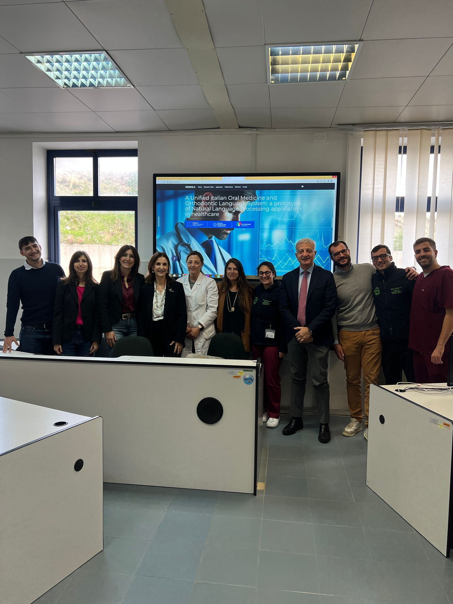

On **10 November 2025**, a dedicated meeting was held at the *Policlinico of Messina*, followed by a second session on **11 November 2025** at the *Policlinico of Catania*, within the framework of the **UIOMOLS project**.

During these meetings, the research units involved in the project were introduced to the architecture and core functionalities of the platform, including data harmonization, clinical text processing, and Natural Language Processing-based analysis of Electronic Health Records.

The events also actively involved **dentistry students and postgraduate residents**, who participated in the demonstration sessions and testing activities.

The feedback collected during both meetings proved to be extremely valuable. The observations and suggestions provided by researchers, clinicians, students, and residents contributed to refining the user interface, improving workflow efficiency, and enhancing several analytical features of the platform.  

This exchange represented a significant step toward optimizing UIOMOLS and aligning its development with real clinical, research, and educational needs.

---

### 📷 Event Photo

